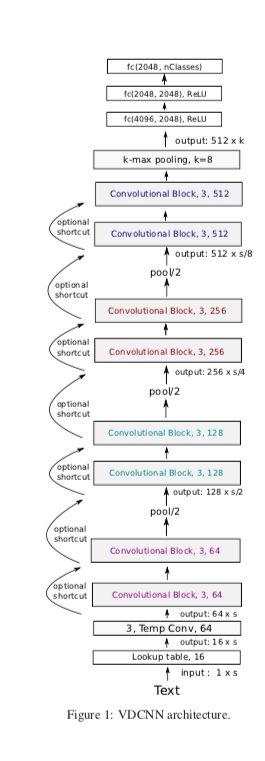
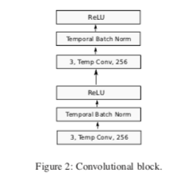

# Very-Deep-Convolutional-Neural-Network-for-Sentiment-Analysis

This repo contains the ipython notebook implementing Very Deep Convolutional Neural Network for Text Analysis based on the research paper- https://arxiv.org/abs/1606.01781

# Why I implemented this research paper?

In this paper they have tried the approach of VGG16 which is a deep learning model very efficient for image classification which have pushed the state-of-the-art in computer vision.
Instead of doing the traditional approach like bag-of-words or n-grams and their TF-IDF this paper has considered each character as a unique entity in itself and instead of doing a word2vec they have done char2vec similar to taking into consideration a pixel the most basic unit in a image for calculation.
So basically they have tried to model their approach on the deep convolutional networks approach for computer vision.

#Architecture-

I am further looking at increasing the depth of the model for better results.
